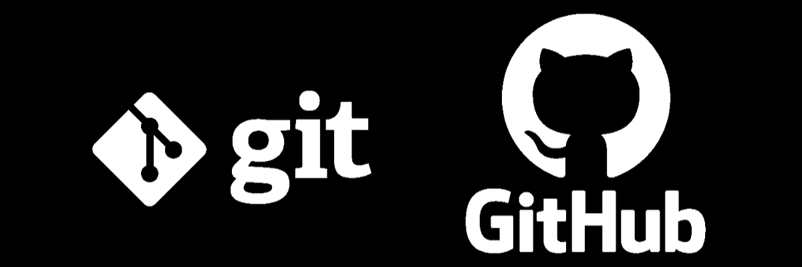

<div align="center">

[](https://medium.com/@talktorahul.b/git-github-explained-126e54926402)
  
# Git e GitHub 

</div>

<div align="center">
  
  [](LICENSE.md)

</div>

Clique **[aqui](pdf/projeto-pessoal-github.pdf)** para visualizar o PDF do projeto.

## :technologist: Projeto Pessoal GitHub

### Ferramentas usadas:


### Linguagens usadas:


### Índice:
- [Exercício 01 - Melhorando o visual do README](projeto-pessoal-github/exercício-01_melhorando-o-visual-do-readme.md)
- [Exercício 02 - Inserindo recursos no README](projeto-pessoal-github/exercício-02_inserindo-recursos-no-README.md)
- [Exercício 03 - Organização do README](projeto-pessoal-github/exercício-03_organização-do-README.md)
- [Exercício 04 – Blocos de código](projeto-pessoal-github/exercício-04_blocos-de-código.md)
- [Exercício 05 – Checklist de atividades](https://github.com/matos617/aponti-fap-teste-de-software-turma-18/issues/1)
- [Exercício 06 – Criando uma tabela](projeto-pessoal-github/exercício-06_criando-uma-tabela.md)
- [Exercício 07 – Badges do GitHub](projeto-pessoal-github/exercício-07_badges-do-github.md) :heavy_check_mark:
- [Exercício 08 – Inserindo citações](projeto-pessoal-github/exercício-08_inserindo-citações.md)
- [Exercício 09 – Links internos](projeto-pessoal-github/exercício-09_links-internos.md) :heavy_check_mark:
- [Exercício 10 – Desafio Final](projeto-pessoal-github/exercício-10_desafio-final.md)


### O que foi aprendido nas aulas de Git e GitHub:

| Assunto | Conteúdo | Meu nível |
:--------------|:------------------:| -----------------:
| Git     | Principais comandos no Git Bash, Branches, Merges, Pull Requestes | Básico |
| GitHub  | Noções básicas do site, como criar repositórios | Intermediário |
| Markdown | Criação de um portifólio profissional | Intermediário |

<details>
  
<summary>Comandos Git Utilizados:</summary>

```
git clone    # Clonar repositótio
mkdir projeto    # Cria diretórios e subdiretórios (pastas) pelo terminal.
cd projeto    # Muda o diretório atual para o diretório especificado.
git init    # Inicializando o repositório Git
git status    # Mostra o estado atual do repositório
```

##### Criando um arquivo README.md:
```bash 
git add README.md
git status
git commit -m "Primeiro commit - Adicionando o arquivo README.md" 
git log
```

##### Adicionar
```bash
git add nome_arquivo 
#ou
git add .
```
`git add nome_arquivo` adiciona um arquivo específico à Staging Area, o `git add .` adiciona todos os arquivos.

##### "Gravar" histórico
```bash
git commit -m "mensagem do commit"
```
Cria um commit com uma mensagem descritiva.

##### Histórico
```bash
git log
```
Exibe o histórico de commits do repositório.

</details>

### :bulb: Citação

<div align="center">

> *"Todo mundo deveria aprender a programar, porque isso ensina a pensar."*
> 
> —— Steve Jobs, co-fundador da Apple.

</div>

---

<div align="center">

<a href="https://gifdb.com/gif/nyan-cat-rbnlqzxbgvei37v8.html"></a>

Atividade feita por **Carla Beatriz Matos** <br>
###
[](https://github.com/matos617)

</div>
