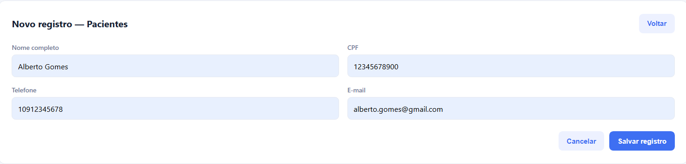
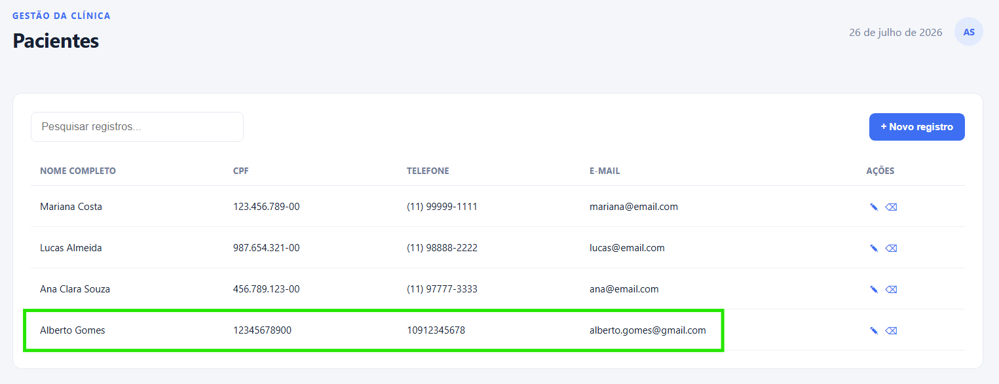
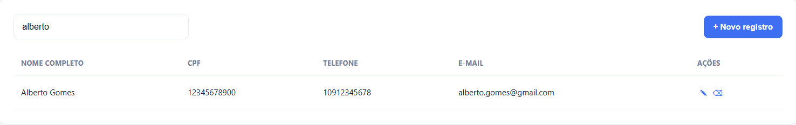
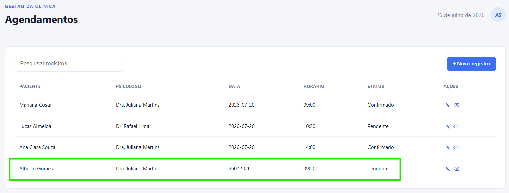
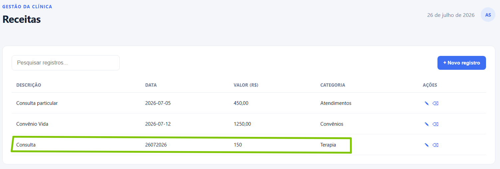
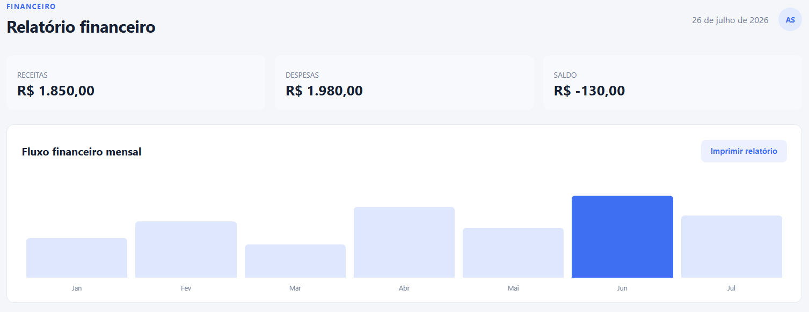
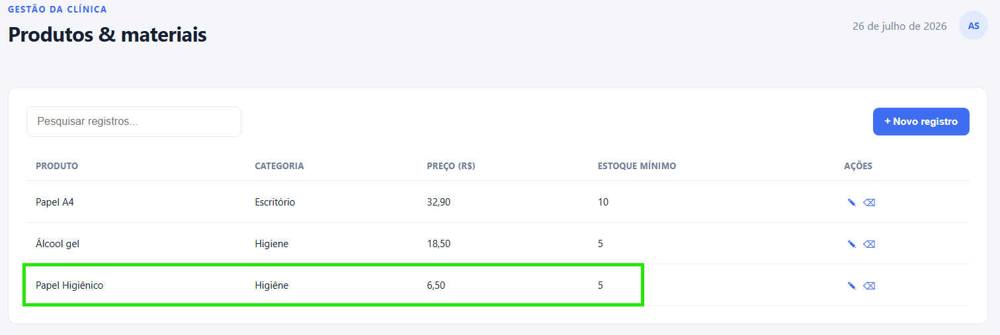
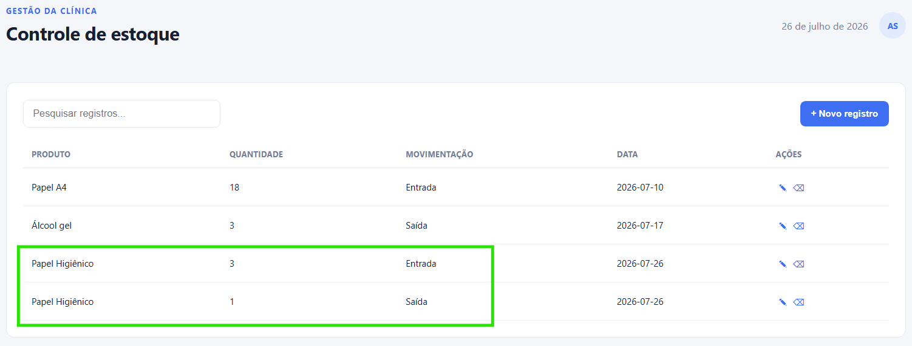
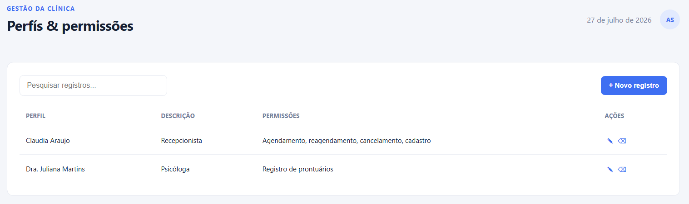

# Parte 1 — Testes funcionais

 

##  Identificação das funcionalidades
| Funcionalidade | Objetivo | Usuário | Entrada principal | Resultado esperado | Possível erro |
| --- | --- | --- | --- | --- | --- |
| Cadastro de pacientes | Registrar novos pacientes no sistema | Recepcionista ou administrador | Nome, CPF, telefone, e-mail, endereço | Paciente cadastrado e disponível na base | CPF inválido, campos obrigatórios em branco, duplicidade de cadastro |
| Agendamento de consultas | Marcar consultas entre paciente e psicólogo | Recepcionista ou paciente | Nome do paciente, psicólogo, data e horário | Consulta registrada na agenda | Horário já ocupado, paciente inexistente, psicólogo indisponível |
| Reagendamento e cancelamento | Alterar ou cancelar consultas já marcadas | Recepcionista ou paciente | Consulta original, nova data/horário (se reagendar) | Consulta atualizada ou removida da agenda | Consulta não encontrada, novo horário indisponível |
| Registro de prontuários | Guardar informações clínicas e evolução do paciente | Psicólogo | Identificação do paciente, notas da sessão, evolução | Prontuário salvo e acessível para futuras consultas | Falha ao salvar, paciente não encontrado, acesso negado por perfil |
| Emissão de relatórios financeiros | Gerar relatórios de receitas e despesas da clínica | Administrador ou financeiro |  Período de análise, tipo de relatório | Relatório exibido ou exportado. | Período inválido, ausência de dados, falha na geração |

 

##  Testes Unitários
| Função/regra | Entrada | Resultado esperado | Por que é unitário? |
| --- | --- | --- | --- |
| Validação de CPF | “123.456.789-00” | Retorno “válido” ou “inválido” | Testa de forma isolada a regra de validação de CPF, sem depender de banco de dados ou interface e mostrando que o sistema rejeita CPFs incorretos |
| Validação do número do CRP | “12/34567” | Retorno “válido” ou “inválido” | Avalia apenas a regra de formatação e consistência do CRP |
| Cálculo do saldo financeiro | Receitas R$ 2.000; despesas R$ 800 | R$ 1.200 | Verifica isoladamente a fórmula de cálculo |
| Identificação de estoque abaixo do mínimo | Estoque atual = 3; mínimo = 5 | Alerta “estoque baixo” | Testa apenas a regra de comparação de valores |
| Validação de e-mail | “usuario@dominio.com” | Retorno “válido” ou “inválido” | Avalia isoladamente a regra de validação de formato de e-mail |

 

##  Testes de integração 
| Componentes integrados  | Ação | Resultado esperado | Risco |
| --- | --- | --- | --- |
| Cadastro de paciente com Banco de dados | Cadastrar novo paciente | Dados gravados corretamente no banco e paciente aparece na lista | Paciente não salvo ou duplicado |
| Agendamento + Agenda do psicólogo | Agendar consulta | Horário passa a constar como ocupado na agenda do psicólogo | Dois pacientes no mesmo horário |
| Check-in + Controle de presença | Realizar check-in do paciente na recepção | Presença registrada no sistema | Paciente não aparece como presente ou duplicidade de presença | 
| Consulta realizada + Lançamento financeiro | Finalizar consulta de paciente | Valor da sessão lançado automaticamente no financeiro | Consulta registrada sem cobrança ou cobrança duplicada |
| Compra de produto + Estoque | Registrar compra de produto | Quantidade adicionada ao estoque | Estoque não atualizado ou valor incorreto |

 

## :desktop_computer: Testes de sistema (Cenários)

### Cenário A — Atendimento completo
- **Pré-condições**: Sistema ativo; paciente não cadastrado.  
- **Dados utilizados**: Nome, CPF, telefone, psicólogo, data/hora da consulta, evolução da sessão, valor da consulta.  
- **Passos**:  
  1. Cadastrar paciente.  
  2. Localizar paciente.  
  3. Agendar consulta.  
  4. Fazer check-in.  
  5. Registrar evolução da sessão.  
  6. Lançar receita.  
  7. Conferir relatório financeiro.  
- **Resultado esperado**: Fluxo completo registrado.

#### Dados criados
| Campo | Valor |
| --- | --- |
| Nome | Alberto Gomes |
| CPF | 123.456.789-00 |
| Telefone | (10) 9 1234-5678 |
| e-mail | alberto.gomes@gmail.com |
| Psicólogo | Dra. Juliana Martins |
| Data | 26/07/2026 |
| Horário | 09:00 |

- **Resultado obtido**: Usuário foi cadastrado com sucesso, mas os valores *CPF*, *Telefone* não foram convertidos.
- **Situação**: 
- **Evidência**:

### Cenário B — Reagendamento
- **Pré-condições**: Paciente e psicólogo cadastrados.  
- **Dados utilizados**: Consulta marcada para horário X.  
- **Passos**:  
  1. Criar agendamento.  
  2. Reagendar para novo horário.  
  3. Verificar liberação do horário anterior.  
  4. Conferir ocupação do novo horário.  
  5. Validar agenda atualizada.  
- **Resultado esperado**: Consulta movida corretamente, sem duplicidade.  
- **Resultado obtido**: Ocorreu o reagendamento com sucesso.
- **Situação**:  
- **Evidência**:

### Cenário C — Controle de estoque
- **Pré-condições**: Produto não cadastrado.  
- **Dados utilizados**: Nome do produto, quantidade mínima, entradas e saídas.  
- **Passos**:  
  1. Cadastrar produto.  
  2. Registrar entrada.  
  3. Registrar saída.  
  4. Verificar quantidade final.  
  5. Conferir alerta de estoque mínimo.  
- **Resultado esperado**: Estoque atualizado corretamente e alerta exibido.  
- **Resultado obtido**: Cadastro do produto e sua entrada e saída foram um sucesso, mas não emitiu alerta de estoque mínimo atualizado.
- **Situação**: 
- **Evidência**:

### Cenário D — Controle de acesso
- **Pré-condições**: Perfis criados (recepcionista e psicólogo).  
- **Dados utilizados**: Login e senha de cada perfil.  
- **Passos**:  
  1. Criar perfis com permissões diferentes.  
  2. Entrar como recepcionista.  
  3. Tentar acessar prontuários.  
  4. Entrar como psicólogo.  
  5. Validar acesso autorizado.  
- **Resultado esperado**: Recepcionista bloqueado; psicólogo autorizado.  
- **Resultado obtido**: Perfis com permissões diferentes, recepcionista acessa prontuário e psicólogo valida acesso.
- **Situação**:   
- **Evidência**:

 

## :ballot_box_with_check: Testes de aceitação

### 1. Agendamento sem conflito
- **Dado que** o paciente e o psicólogo estejam cadastrados,  
- **quando** a recepcionista tentar agendar uma consulta em um horário já ocupado,  
- **então** o sistema deverá impedir o agendamento e exibir uma mensagem de erro.  

### 2. Acesso a prontuários
- **Dado que** existam perfis diferentes no sistema,  
- **quando** um recepcionista tentar acessar os prontuários,  
- **então** o sistema deverá negar o acesso e exibir mensagem de permissão insuficiente.  

### 3. Atualização financeira
- **Dado que** uma receita ou despesa seja lançada,  
- **quando** o lançamento for confirmado,  
- **então** o sistema deverá atualizar automaticamente o saldo financeiro da clínica.  

### 4. Controle de estoque
- **Dado que** um produto esteja cadastrado com quantidade mínima definida,  
- **quando** o estoque atingir ou ficar abaixo desse valor,  
- **então** o sistema deverá emitir um alerta de estoque baixo.  

### 5. Localização de pacientes
- **Dado que** existam pacientes cadastrados,  
- **quando** o usuário pesquisar por nome ou CPF,  
- **então** o sistema deverá localizar e exibir o paciente correspondente.  

 

## 📝 Classificação dos testes

### 1. Verificar se `receitas − despesas` retorna o saldo correto

   - **Classificação**: **Unitário**  
   - **Justificativa**: Testa isoladamente a regra de cálculo do saldo, sem depender de interface ou banco de dados.

### 2. Verificar se uma receita salva aparece no relatório financeiro

   - **Classificação**: **Integração**  
   - **Justificativa**: Avalia se o módulo de lançamento de receita comunica corretamente com o módulo de relatórios.

### 3. Executar todo o fluxo entre cadastro, atendimento e pagamento

   - **Classificação**: **Sistema**  
   - **Justificativa**: Testa o sistema completo, simulando o fluxo real de uso pelo usuário final.

### 4. Confirmar com a direção da clínica se o relatório atende às necessidades administrativas

   - **Classificação**: **Aceitação**  
   - **Justificativa**: Verifica se o sistema atende às necessidades do negócio e pode ser aprovado pelo cliente.  

### 5. Verificar isoladamente a validação de CPF

   - **Classificação**: **Unitário**  
   - **Justificativa**: Testa apenas a regra de validação de CPF, sem depender de outros componentes.  

### 6. Verificar se um reagendamento atualiza a agenda

   - **Classificação**: **Integração**  
   - **Justificativa**: Avalia se o módulo de reagendamento comunica corretamente com a agenda do psicólogo.  

### 7. Avaliar se apenas psicólogos podem visualizar prontuários

   - **Classificação**: **Sistema**  
   - **Justificativa**: Testa o controle de acesso dentro do sistema, simulando perfis diferentes.  

### 8. Confirmar com a recepcionista se o processo de agendamento é adequado à rotina da clínica

   - **Classificação**: **Aceitação**  
   - **Justificativa**: Verifica se o sistema atende às necessidades práticas da recepcionista, sob o ponto de vista do usuário final.

 

---

# Parte 2 — Checklist de testes não funcionais

## 🔹 Performance

| O que verificar | Como verificar | Critério esperado | Risco | Prioridade |
|-----------------|----------------|-------------------|-------|------------|
| Tempo de carregamento da página inicial | Medir com cronômetro em diferentes dispositivos | Carregar em até 3 segundos | Lentidão no atendimento | :red_circle: Alta |
| Tempo para abrir a agenda | Testar com 100 agendamentos cadastrados | Abrir em até 2 segundos | Atraso no atendimento | :red_circle: Alta |
| Velocidade da pesquisa de pacientes | Pesquisar por nome e CPF em base com 1.000 registros | Resultado em até 2 segundos | Dificuldade em localizar pacientes | :red_circle: Alta |
| Tempo para salvar registros | Inserir dados de paciente e medir tempo de resposta | Salvar em até 1 segundo | Perda de produtividade | :yellow_circle: Média |
| Consumo de memória após uso prolongado | Usar o sistema por 2h e monitorar consumo | Não ultrapassar 500 MB | Travamento do navegador | :yellow_circle: Média |

### Resultados
| Verificado | status |
| --- | --- |
| Tempo de carregamento da página inicial | :heavy_check_mark: |
| Tempo para abrir a agenda | :heavy_check_mark: |
| Velocidade da pesquisa de pacientes | :heavy_check_mark: |
| Tempo para salvar registros | :heavy_check_mark: |
| Consumo de memória após uso prolongado | :heavy_check_mark: |

## 🔹 Segurança

| O que verificar | Como verificar | Critério esperado | Risco | Prioridade |
|-----------------|----------------|-------------------|--------|------------|
| Acesso a prontuários sem autenticação | Tentar acessar URL diretamente sem login | Bloqueio imediato | Violação de sigilo | :red_circle: Alta |
| Restrição por perfil de usuário | Entrar como recepcionista e tentar acessar prontuários | Acesso negado | Exposição de dados sensíveis | :red_circle: Alta |
| Uso de senhas fracas | Tentar cadastrar senha "123456" | Bloqueio da senha | Invasão de contas | :red_circle: Alta |
| Expiração da sessão | Deixar sessão aberta por 30 min sem uso | Logout automático | Uso indevido por terceiros | :yellow_circle: Média |
| Entrada de scripts nos formulários | Inserir `` em campo de texto | Ser tratado como texto e não ser executado | Execução de código malicioso | :red_circle: Alta |

### Resultados
| Verificado | status |
| --- | --- |
| Acesso a prontuários sem autenticação | :x: |
| Restrição por perfil de usuário | :x: |
| Uso de senhas fracas | :x: |
| Expiração da sessão | :x: |
| Entrada de scripts nos formulários | :heavy_check_mark: |

## 🔹 Usabilidade

| O que verificar | Como verificar | Critério esperado | Risco | Prioridade |
|-----------------|----------------|-------------------|--------|------------|
| Clareza dos nomes dos menus | Avaliar se os nomes são intuitivos | Menus claros e autoexplicativos | Dificuldade de uso | :yellow_circle: Média |
| Facilidade para cadastrar paciente | Contar número de etapas necessárias | Cadastro em até 3 etapas | Demora no atendimento | :red_circle: Alta |
| Mensagens de erro e sucesso | Inserir dados incorretos e observar mensagens | Mensagens claras e informativas | Cadastro incorreto | :yellow_circle: Média |
| Indicação de campos obrigatórios | Tentar salvar sem preencher campos obrigatórios | Sistema alerta o usuário | Dados incompletos | :red_circle: Alta |
| Navegação pelo teclado | Usar apenas TAB e ENTER para navegar | Navegação funcional | Barreiras para usuários com deficiência | :yellow_circle: Média |

### Resultados
| Verificado | status |
| --- | --- |
| Clareza dos nomes dos menus | :heavy_check_mark: |
| Facilidade para cadastrar paciente | :heavy_check_mark: |
| Mensagens de erro e sucesso | :x: |
| Indicação de campos obrigatórios | :x: |
| Navegação pelo teclado | :heavy_check_mark: |

## 🔹 Compatibilidade

| O que verificar | Como verificar | Critério esperado | Risco | Prioridade |
|-----------------|----------------|-------------------|--------|------------|
| Funcionamento em Chrome, Firefox e Edge | Abrir sistema em cada navegador | Funcionar sem falhas | Usuários sem acesso | :red_circle: Alta |
| Funcionamento em celular, tablet e computador | Testar em diferentes dispositivos | Layout responsivo | Tabelas cortadas em mobile | :red_circle: Alta |
| Diferentes resoluções (360px, 768px, 1366px) | Ajustar resolução da tela | Exibição correta | Layout quebrado | :yellow_circle: Média |
| Orientação vertical e horizontal | Rotacionar dispositivo móvel | Layout adaptado | Perda de dados visíveis | :yellow_circle: Média |
| Exibição correta de acentos e símbolos | Inserir nomes com acentos e caracteres especiais | Exibição correta | Dados ilegíveis | :yellow_circle: Média |

### Resultados
| Verificado | status |
| --- | --- |
| Funcionamento em Chrome, Firefox e Edge | :heavy_check_mark: |
| Funcionamento em celular, tablet e computador | :heavy_check_mark: |
| Diferentes resoluções | :question: (Não testada) |
| Orientação vertical e horizontal | :heavy_check_mark: |
| Exibição correta de acentos e símbolos | :heavy_check_mark: |

---

# :lady_beetle: Relatório de Defeitos Encontrados

## :bar_chart: Resumo dos Defeitos
---

  Domingo, dia 26 de Julho de 2026

